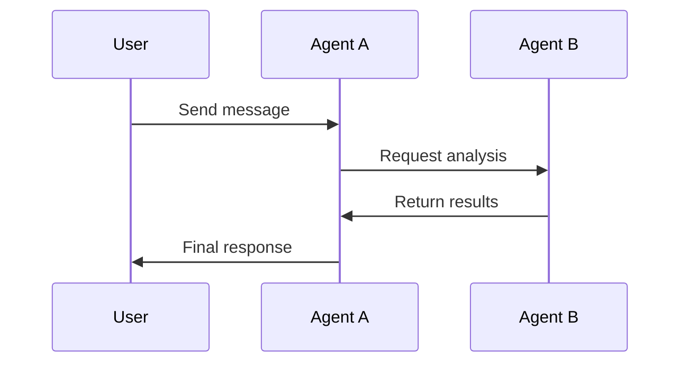

# Playground

The Bindu Playground is an interactive environment where you can experiment with agents, test protocols, and explore multi-agent systems without writing code.

<Note>
The playground is coming soon! In the meantime, you can test agents locally using the quickstart guide.
</Note>

## Features

<CardGroup cols={2}>
  <Card title="Interactive Testing" icon="play">
    Test agents with real-time feedback
  </Card>
  <Card title="Protocol Explorer" icon="compass">
    Explore A2A and AP2 protocol features
  </Card>
  <Card title="Multi-Agent Scenarios" icon="users">
    Simulate agent collaboration
  </Card>
  <Card title="Visual Debugging" icon="bug">
    See message flows and state changes
  </Card>
</CardGroup>

## What You Can Do

### Test Agent Responses

Send messages to agents and see how they respond:

```json
{
  "message": "Explain quantum computing in simple terms",
  "agent": "research-agent",
  "model": "gpt-4o"
}
```

### Visualize Agent Communication

See how agents communicate using the Bindu protocol:



### Experiment with Tools

Test different tools and see how agents use them:

- Web search
- File operations
- API calls
- Database queries
- Custom functions

### Monitor Performance

Track agent metrics in real-time:

- Response time
- Token usage
- Success rate
- Error frequency

## Coming Soon

<AccordionGroup>
  <Accordion title="Agent Builder" icon="hammer">
    Visual interface to create and configure agents without code
  </Accordion>

  <Accordion title="Workflow Designer" icon="diagram-project">
    Design multi-agent workflows with drag-and-drop
  </Accordion>

  <Accordion title="Testing Suite" icon="flask">
    Automated testing for agent behavior and responses
  </Accordion>

  <Accordion title="Collaboration Mode" icon="users">
    Share playground sessions with team members
  </Accordion>

  <Accordion title="Template Library" icon="book">
    Pre-built agent templates for common use cases
  </Accordion>
</AccordionGroup>

## Local Testing

While the playground is in development, you can test agents locally:

### Quick Test Script

```python
import requests
import uuid

def test_agent(message: str, agent_url: str = "http://localhost:8030"):
    payload = {
        "jsonrpc": "2.0",
        "method": "message/send",
        "params": {
            "message": {
                "role": "user",
                "parts": [{"kind": "text", "text": message}],
                "kind": "message",
                "messageId": str(uuid.uuid4()),
                "contextId": str(uuid.uuid4()),
                "taskId": str(uuid.uuid4())
            },
            "configuration": {
                "acceptedOutputModes": ["application/json"]
            }
        },
        "id": str(uuid.uuid4())
    }
    
    response = requests.post(agent_url, json=payload)
    return response.json()

# Test your agent
result = test_agent("Hello, how are you?")
print(result)
```

### Interactive CLI

```bash
# Install Bindu CLI (coming soon)
pip install bindu-cli

# Start interactive session
bindu playground

# Test agent
> send "What is the weather today?"

# List available agents
> agents list

# Switch agent
> use research-agent

# View agent card
> agent info
```

## Use Cases

### Learning

- Understand how agents process messages
- Explore protocol features
- Test different models and configurations

### Development

- Prototype agent behavior
- Test tool integrations
- Debug agent interactions

### Demonstration

- Show agent capabilities to stakeholders
- Create interactive demos
- Present multi-agent workflows

## Best Practices

<Tip>
Start with simple single-agent tests before moving to complex multi-agent scenarios.
</Tip>

1. **Start Simple**: Test basic functionality first
2. **Iterate Quickly**: Make small changes and test immediately
3. **Save Scenarios**: Keep successful test cases for regression testing
4. **Monitor Costs**: Track token usage when testing with paid models
5. **Document Findings**: Note interesting behaviors and edge cases

## Next Steps

<CardGroup cols={2}>
  <Card title="Quickstart" icon="rocket" href="/quickstart">
    Build your first agent
  </Card>
  <Card title="Examples" icon="code" href="/examples">
    See example implementations
  </Card>
  <Card title="API Reference" icon="book" href="/api-reference">
    Explore the API
  </Card>
  <Card title="Monitoring" icon="chart-line" href="/introduction/monitoring">
    Learn about monitoring
  </Card>
</CardGroup>
