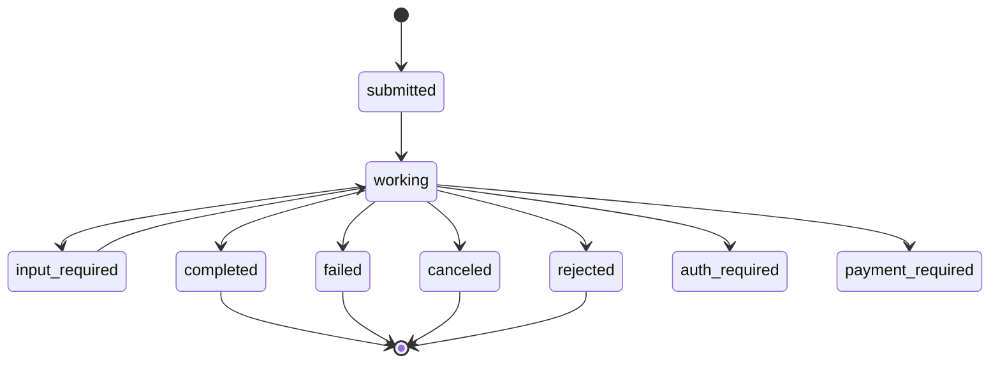
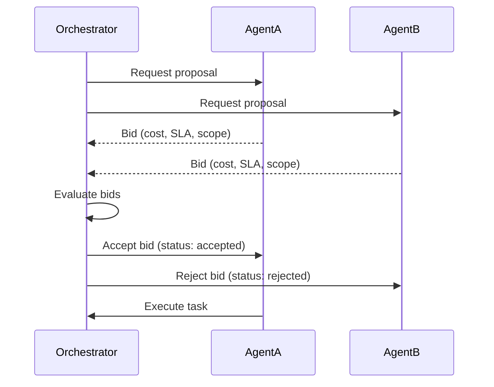

# Bindu Protocol

**The Language of Agents: A2A and AP2 Protocol Types**

In the constellation of autonomous agents, communication is everything. Just as humans developed languages to share ideas, agents need a precise vocabulary to understand each other. This is where **A2A (Agent-to-Agent)** and **AP2 (Agent Protocol 2)** come alive.

Bindu implements these protocols as the Rosetta Stone for agent communication - every message, every task, every handshake between agents is defined here. These aren't just data structures; they're the building blocks of trust, the grammar of collaboration, and the syntax of emergent intelligence.

**Official Specifications:**
- [A2A Protocol v0.3.0](https://a2a-protocol.org/latest/specification/)
- [AP2 Protocol v0.1.0](https://ap2-protocol.org/specification/)

<Note>
Bindu follows **A2A v0.3.0** and **AP2 v0.1.0** with additional extensions marked as `<NotPartOfA2A>` for enhanced functionality.
</Note>

## Protocol Overview

Bindu's protocol is built on four foundational pillars:

<CardGroup cols={2}>
  <Card title="JSON-RPC 2.0" icon="code">
    Standard request/response messaging protocol
  </Card>
  <Card title="Task-Based Model" icon="list-check">
    Stateful execution units coordinating client-agent interaction
  </Card>
  <Card title="Context Management" icon="folder">
    Conversation sessions grouping related tasks
  </Card>
  <Card title="Type Safety" icon="shield-check">
    Pydantic-validated TypedDict structures
  </Card>
</CardGroup>

## Core Protocol Entities

### Messages

Messages represent all non-result communication in the Bindu protocol. Unlike Artifacts (which contain task outputs), Messages carry operational content like instructions, status updates, context, and metadata.

```python
class Message(TypedDict):
    message_id: Required[UUID]
    context_id: Required[UUID]
    task_id: Required[UUID]
    reference_task_ids: NotRequired[list[UUID]]
    kind: Required[Literal["message"]]
    metadata: NotRequired[dict[str, Any]]
    parts: Required[list[Part]]
    role: Required[Literal["user", "agent", "system"]]
    extensions: NotRequired[list[str]]
```

**Message Types:**
- **User Instructions**: Task requests with context and files
- **Agent Communication**: Status updates, thoughts, coordination
- **System Messages**: Errors, warnings, protocol information
- **Context Sharing**: Background information, references, metadata

**Multi-part Structure:**

Messages can contain multiple parts to organize different content types:

<AccordionGroup>
  <Accordion title="TextPart" icon="text">
    ```python
    class TextPart(TypedDict):
        kind: Required[Literal["text"]]
        text: Required[str]
        metadata: NotRequired[dict[str, Any]]
        embeddings: NotRequired[list[float]]  # <NotPartOfA2A>
    ```
  </Accordion>

  <Accordion title="FilePart" icon="file">
    ```python
    class FilePart(TextPart):
        kind: Required[Literal["file"]]
        file: Required[FileWithBytes | FileWithUri]
        embeddings: NotRequired[list[float]]  # <NotPartOfA2A>
    ```
  </Accordion>

  <Accordion title="DataPart" icon="database">
    ```python
    class DataPart(TextPart):
        kind: Required[Literal["data"]]
        data: Required[dict[str, Any]]
        embeddings: NotRequired[list[float]]  # <NotPartOfA2A>
    ```
  </Accordion>
</AccordionGroup>

### Tasks

Tasks serve as the primary coordination mechanism in the Bindu protocol, managing the complete lifecycle from request to completion.

```python
class Task(TypedDict):
    id: Required[UUID]
    context_id: Required[UUID]
    kind: Required[Literal["task"]]
    status: Required[TaskStatus]
    artifacts: NotRequired[list[Artifact]]
    history: NotRequired[list[Message]]
    metadata: NotRequired[dict[str, Any]]
```

**Core Responsibilities:**
- **Message Exchange**: Facilitate communication between clients and agents
- **State Management**: Track task progress and execution status
- **Artifact Collection**: Gather and organize agent-generated outputs
- **History Tracking**: Maintain complete conversation and decision trail

**Task Lifecycle:**



**Task States:**

| State | Description | A2A Standard |
|-------|-------------|--------------|
| `submitted` | Task submitted, awaiting execution | ✓ |
| `working` | Agent actively working on the task | ✓ |
| `input-required` | Task paused, waiting for user input | ✓ |
| `completed` | Task successfully completed | ✓ |
| `canceled` | Task canceled by user | ✓ |
| `failed` | Task failed due to error | ✓ |
| `rejected` | Task rejected by agent | ✓ |
| `auth-required` | Authentication required to proceed | ✓ |
| `payment-required` | Payment required to proceed | Extension |
| `unknown` | Unknown or indeterminate state | Extension |
| `trust-verification-required` | Trust verification required | Extension |
| `pending` | Task pending execution | Extension |
| `suspended` | Task suspended, not running | Extension |
| `resumed` | Task resumed after suspension | Extension |
| `negotiation-bid-submitted` | Bid submitted for negotiation | Extension |
| `negotiation-bid-lost` | Bid lost in negotiation | Extension |
| `negotiation-bid-won` | Bid won in negotiation | Extension |

### Artifacts

Artifacts represent the final output generated by an agent after completing a task. They are immutable data structures containing the results of agent execution.

```python
class Artifact(TypedDict):
    artifact_id: Required[UUID]
    name: NotRequired[str]
    description: NotRequired[str]
    metadata: NotRequired[dict[str, Any]]
    parts: NotRequired[list[Part]]
    append: NotRequired[bool]
    last_chunk: NotRequired[bool]
    extensions: NotRequired[list[str]]
```

**Key Properties:**
- **Immutable**: Once created, artifacts cannot be modified
- **Multi-part**: Can contain text, files, and structured data
- **Streamable**: Parts can be appended during streaming responses
- **Traceable**: Each artifact has a unique ID for reference

### Contexts

Contexts serve as conversation containers, managing the complete interaction lifecycle between clients and agents.

```python
class Context(TypedDict):
    context_id: Required[UUID]
    kind: Required[Literal["context"]]
    tasks: NotRequired[list[UUID]]
    name: NotRequired[str]
    description: NotRequired[str]
    role: Required[str]
    created_at: Required[str]
    updated_at: Required[str]
    status: NotRequired[Literal["active", "paused", "completed", "archived"]]
    tags: NotRequired[list[str]]
    metadata: NotRequired[dict[str, Any]]
    parent_context_id: NotRequired[UUID]
    reference_context_ids: NotRequired[list[UUID]]
    extensions: NotRequired[dict[str, Any]]
```

**Core Responsibilities:**
- **Session Management**: Group related tasks under a unified conversation
- **History Preservation**: Maintain complete message history across tasks
- **Context Continuity**: Preserve conversation state and references
- **Metadata Tracking**: Store session-level information and preferences

## JSON-RPC 2.0 Protocol

All communication in Bindu uses JSON-RPC 2.0 for request/response messaging.

### Base Types

```python
class JSONRPCMessage(TypedDict):
    jsonrpc: Required[Literal["2.0"]]
    id: Required[UUID]

class JSONRPCRequest(JSONRPCMessage, Generic[Method, Params]):
    method: Required[Method]
    params: Required[Params]

class JSONRPCResponse(JSONRPCMessage, Generic[ResultT, ErrorT]):
    result: NotRequired[ResultT]
    error: NotRequired[ErrorT]

class JSONRPCError(TypedDict, Generic[CodeT, MessageT]):
    code: Required[CodeT]
    message: Required[MessageT]
    data: NotRequired[Any]
```

### Message Operations

<AccordionGroup>
  <Accordion title="message/send" icon="paper-plane">
    Send a message and wait for complete response.
    
    **Request:**
    ```json
    {
      "jsonrpc": "2.0",
      "id": "550e8400-e29b-41d4-a716-446655440000",
      "method": "message/send",
      "params": {
        "message": {
          "message_id": "...",
          "context_id": "...",
          "task_id": "...",
          "kind": "message",
          "role": "user",
          "parts": [
            {
              "kind": "text",
              "text": "Analyze this dataset"
            }
          ]
        },
        "configuration": {
          "accepted_output_modes": ["text", "data"],
          "blocking": true
        }
      }
    }
    ```
    
    **Response:**
    ```json
    {
      "jsonrpc": "2.0",
      "id": "550e8400-e29b-41d4-a716-446655440000",
      "result": {
        "id": "...",
        "context_id": "...",
        "kind": "task",
        "status": {
          "state": "completed",
          "timestamp": "2025-10-13T17:30:00Z"
        },
        "artifacts": [...]
      }
    }
    ```
  </Accordion>

  <Accordion title="message/stream" icon="stream">
    Stream messages with real-time updates via Server-Sent Events (SSE).
    
    **Request:**
    ```json
    {
      "jsonrpc": "2.0",
      "id": "550e8400-e29b-41d4-a716-446655440000",
      "method": "message/stream",
      "params": {
        "message": { /* Message object */ },
        "configuration": {
          "accepted_output_modes": ["text", "data"]
        }
      }
    }
    ```
    
    **Response (SSE Stream):**
    ```
    event: status-update
    data: {"task_id": "...", "status": {"state": "working", "timestamp": "..."}}

    event: artifact-update
    data: {"artifact": {...}, "append": true, "last_chunk": false}

    event: status-update
    data: {"task_id": "...", "status": {"state": "completed", "timestamp": "..."}, "final": true}
    ```
  </Accordion>
</AccordionGroup>

### Task Operations

<AccordionGroup>
  <Accordion title="tasks/get" icon="clipboard">
    Retrieve task details and history.
    
    **Request:**
    ```json
    {
      "jsonrpc": "2.0",
      "id": "...",
      "method": "tasks/get",
      "params": {
        "task_id": "550e8400-e29b-41d4-a716-446655440000",
        "history_length": 10
      }
    }
    ```
    
    **Response:**
    ```json
    {
      "jsonrpc": "2.0",
      "id": "...",
      "result": {
        "id": "550e8400-e29b-41d4-a716-446655440000",
        "context_id": "...",
        "kind": "task",
        "status": {...},
        "artifacts": [...],
        "history": [...]
      }
    }
    ```
  </Accordion>

  <Accordion title="tasks/cancel" icon="ban">
    Cancel a running task.
    
    **Request:**
    ```json
    {
      "jsonrpc": "2.0",
      "id": "...",
      "method": "tasks/cancel",
      "params": {
        "task_id": "550e8400-e29b-41d4-a716-446655440000"
      }
    }
    ```
  </Accordion>

  <Accordion title="tasks/list" icon="list">
    List all tasks (Bindu extension).
    
    **Request:**
    ```json
    {
      "jsonrpc": "2.0",
      "id": "...",
      "method": "tasks/list",
      "params": {
        "history_length": 20
      }
    }
    ```
  </Accordion>

  <Accordion title="tasks/feedback" icon="comment">
    Provide feedback on task execution (Bindu extension).
    
    **Request:**
    ```json
    {
      "jsonrpc": "2.0",
      "id": "...",
      "method": "tasks/feedback",
      "params": {
        "task_id": "...",
        "feedback": "Great analysis!",
        "rating": 5
      }
    }
    ```
  </Accordion>
</AccordionGroup>

### Context Operations

<AccordionGroup>
  <Accordion title="contexts/list" icon="folder">
    List all conversation contexts.
    
    **Request:**
    ```json
    {
      "jsonrpc": "2.0",
      "id": "...",
      "method": "contexts/list",
      "params": {
        "history_length": 10
      }
    }
    ```
  </Accordion>

  <Accordion title="contexts/clear" icon="trash">
    Clear a context and its tasks.
    
    **Request:**
    ```json
    {
      "jsonrpc": "2.0",
      "id": "...",
      "method": "contexts/clear",
      "params": {
        "context_id": "..."
      }
    }
    ```
  </Accordion>
</AccordionGroup>

## Error Handling

Bindu implements standard JSON-RPC 2.0 errors plus A2A-specific and custom error codes.

### Standard JSON-RPC Errors

| Code | Error | Description |
|------|-------|-------------|
| -32700 | Parse Error | Invalid JSON payload |
| -32600 | Invalid Request | Request validation failed |
| -32601 | Method Not Found | Method not available |
| -32602 | Invalid Params | Invalid parameters |
| -32603 | Internal Error | Internal server error |

### A2A-Specific Errors

| Code | Error | Description |
|------|-------|-------------|
| -32001 | Task Not Found | Task ID not found |
| -32002 | Task Not Cancelable | Cannot cancel task in current state |
| -32003 | Push Notification Not Supported | Push notifications not supported |
| -32004 | Unsupported Operation | Operation not supported |
| -32005 | Content Type Not Supported | Content type not supported |
| -32006 | Invalid Agent Response | Agent returned invalid response |
| -32007 | Authenticated Extended Card Not Configured | Agent card not configured |

### Bindu Extensions

| Code | Error | Description |
|------|-------|-------------|
| -32008 | Task Immutable | Task in terminal state, cannot modify |
| -32009 | Authentication Required | Authentication required |
| -32010 | Invalid Token | Invalid authentication token |
| -32011 | Token Expired | Authentication token expired |
| -32012 | Invalid Token Signature | Token signature verification failed |
| -32013 | Insufficient Permissions | Insufficient permissions |
| -32020 | Context Not Found | Context ID not found |
| -32021 | Context Not Cancelable | Cannot cancel context |

**Error Response Example:**
```json
{
  "jsonrpc": "2.0",
  "id": "...",
  "error": {
    "code": -32001,
    "message": "The specified task ID was not found...",
    "data": {
      "task_id": "550e8400-e29b-41d4-a716-446655440000"
    }
  }
}
```

## Agent System

### Agent Identity

```python
class AgentIdentity(TypedDict):
    did: Required[str]  # Decentralized Identifier
    did_document: Required[Dict[str, Any]]
    agentdns_url: NotRequired[str]
    endpoint: NotRequired[str]
    public_key: Required[str]
    csr: Required[str]  # Certificate Signing Request
```

### Agent Trust

```python
class AgentTrust(TypedDict):
    identity_provider: Required[IdentityProvider]
    inherited_roles: Required[List[KeycloakRole]]
    certificate: NotRequired[str]
    certificate_fingerprint: NotRequired[str]
    creator_id: Union[UUID, int, str]
    creation_timestamp: int
    trust_verification_required: bool
    allowed_operations: Dict[str, TrustLevel]
```

**Trust Levels:**

| Level | Description |
|-------|-------------|
| `viewer` | View-only access, minimal permissions |
| `guest` | Limited access, read-only operations |
| `analyst` | Standard operations |
| `operator` | System operations, moderate risk |
| `editor` | Edit operations, moderate risk |
| `auditor` | Sensitive operations |
| `manager` | Management operations, elevated permissions |
| `admin` | Admin operations, minimal risk |
| `support` | Support operations, troubleshooting access |
| `super_admin` | Highest level access, all operations permitted |

### Agent Skills

```python
class Skill(TypedDict):
    id: str
    name: str
    description: str
    tags: list[str]
    examples: NotRequired[list[str]]
    input_modes: list[str]  # Supported MIME types for input
    output_modes: list[str]  # Supported MIME types for output
```

### Agent Card

```python
class AgentCard(TypedDict):
    id: Required[UUID]
    name: Required[str]
    description: Required[str]
    url: Required[str]
    version: Required[str]
    protocol_version: Required[str]
    documentation_url: NotRequired[str]
    icon_url: NotRequired[str]
    
    agent_trust: Required[AgentTrust]
    capabilities: Required[AgentCapabilities]
    skills: Required[List[Skill]]
    
    kind: Required[Literal["agent", "team", "workflow"]]
    execution_cost: NotRequired[AgentExecutionCost]
    num_history_sessions: Required[int]
```

## AP2 Protocol - Payment & Commerce

Bindu implements the AP2 protocol for agent-to-agent commerce and payments.

### Payment Request

```python
class PaymentRequest(TypedDict):
    method_data: list[PaymentMethodData]
    details: PaymentDetailsInit
    options: NotRequired[PaymentOptions]
    shipping_address: NotRequired[ContactAddress]
```

### Mandates

AP2 defines three types of mandates for secure commerce:

<AccordionGroup>
  <Accordion title="Intent Mandate" icon="lightbulb">
    Represents the user's purchase intent in human-present flows.
    
    ```python
    class IntentMandate(TypedDict):
        user_cart_confirmation_required: Required[bool]
        natural_language_description: Required[str]
        merchants: NotRequired[list[str]]
        skus: NotRequired[list[str]]
        requires_refundability: NotRequired[bool]
        intent_expiry: Required[str]
    ```
  </Accordion>

  <Accordion title="Cart Mandate" icon="shopping-cart">
    A cart whose contents have been digitally signed by the merchant.
    
    ```python
    class CartMandate(TypedDict):
        contents: Required[CartContents]
        merchant_authorization: NotRequired[str]  # JWT signature
    ```
  </Accordion>

  <Accordion title="Payment Mandate" icon="credit-card">
    Contains the user's instructions and authorization for payment.
    
    ```python
    class PaymentMandate(TypedDict):
        payment_mandate_contents: Required[PaymentMandateContents]
        user_authorization: NotRequired[str]  # Verifiable credential
    ```
  </Accordion>
</AccordionGroup>

## Agent Negotiation

Bindu extends A2A with agent-to-agent negotiation capabilities.

```python
class NegotiationProposal(TypedDict):
    proposal_id: Required[UUID]
    from_agent: Required[UUID]
    to_agent: Required[UUID]
    terms: Required[Dict[str, Any]]
    timestamp: Required[str]
    status: Required[NegotiationStatus]  # proposed, accepted, rejected, countered
```

**Negotiation Flow:**



## Security & Authentication

### Security Schemes

Bindu supports multiple authentication methods:

<AccordionGroup>
  <Accordion title="HTTP Auth" icon="key">
    ```python
    class HTTPAuthSecurityScheme(TypedDict):
        type: Required[Literal["http"]]
        scheme: Required[str]  # e.g., "bearer"
        bearer_format: NotRequired[str]
        description: NotRequired[str]
    ```
  </Accordion>

  <Accordion title="API Key" icon="lock">
    ```python
    class APIKeySecurityScheme(TypedDict):
        type: Required[Literal["apiKey"]]
        name: Required[str]
        in_: Required[Literal["query", "header", "cookie"]]
        description: NotRequired[str]
    ```
  </Accordion>

  <Accordion title="OAuth2" icon="shield">
    ```python
    class OAuth2SecurityScheme(TypedDict):
        type: Required[Literal["oauth2"]]
        flows: Required[dict[str, Any]]
        description: NotRequired[str]
    ```
  </Accordion>

  <Accordion title="Mutual TLS" icon="certificate">
    ```python
    class MutualTLSSecurityScheme(TypedDict):
        type: Required[Literal["mutualTLS"]]
        description: NotRequired[str]
    ```
  </Accordion>
</AccordionGroup>

### Push Notifications

```python
class PushNotificationConfig(TypedDict):
    id: Required[UUID]
    url: Required[str]
    token: NotRequired[str]
    authentication: NotRequired[SecurityScheme]
```

## Implementation Notes

<Note>
All types use **Pydantic** for validation and serialization with automatic **camelCase** conversion via `alias_generator=to_camel`.
</Note>

**Key Features:**
- **Type Safety**: TypedDict provides static type checking
- **Runtime Validation**: Pydantic validates at runtime
- **Discriminated Unions**: Type-safe polymorphism for different message/artifact types
- **Generic Types**: Flexible request/response patterns
- **UUID Types**: Unique identification across the system
- **Extensibility**: Protocol designed for backwards-compatible extensions

## Best Practices

<AccordionGroup>
  <Accordion title="Message Design" icon="message">
    - Keep messages focused on a single task
    - Include relevant context in metadata
    - Use appropriate content types (text, file, data)
    - Provide clear instructions and examples
    - Leverage embeddings for semantic search (Bindu extension)
  </Accordion>

  <Accordion title="Task Management" icon="list-check">
    - Always check task status before operations
    - Handle all task states in your client code
    - Use `reference_task_ids` to link related tasks
    - Implement proper error handling for terminal states
    - Respect task immutability in terminal states
  </Accordion>

  <Accordion title="Context Handling" icon="folder">
    - Group related tasks under the same context
    - Use context metadata for session preferences
    - Implement context lifecycle management
    - Clean up completed/archived contexts periodically
  </Accordion>

  <Accordion title="Error Handling" icon="triangle-exclamation">
    - Always check response for errors
    - Implement retry logic with exponential backoff
    - Log errors with full context
    - Provide meaningful error messages to users
    - Handle both A2A standard and Bindu extension errors
  </Accordion>

  <Accordion title="Security" icon="lock">
    - Validate all incoming requests
    - Use minimum required trust levels
    - Implement proper authentication
    - Never expose private keys or credentials
    - Validate JWT signatures
  </Accordion>
</AccordionGroup>

## Next Steps

<CardGroup cols={2}>
  <Card title="Protocol Types" icon="code" href="/protocol-types">
    Complete type definitions and schemas
  </Card>
  <Card title="Quickstart" icon="rocket" href="/quickstart">
    Build your first Bindu agent
  </Card>
  <Card title="Examples" icon="book" href="/examples">
    See protocol implementation examples
  </Card>
  <Card title="GitHub Repository" icon="github" href="https://github.com/Saptha-me/Bindu">
    View the source code
  </Card>
</CardGroup>

---

**When agents need to work together, they speak Bindu.**

The protocol provides a robust foundation for building decentralized AI agent systems following A2A and AP2 specifications with thoughtful extensions for real-world agent collaboration.
