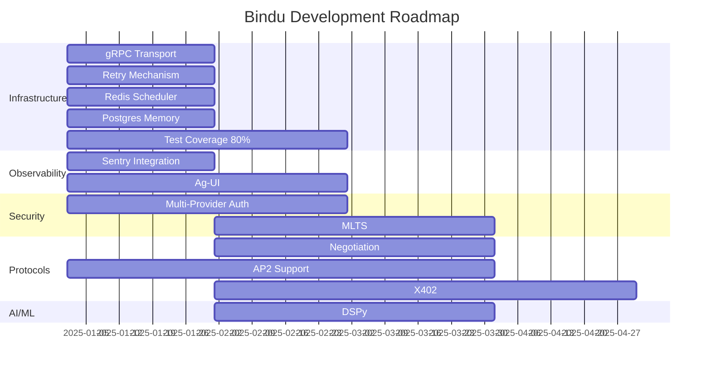

# Bindu Roadmap

Building the most comprehensive and developer-friendly agent framework. Here's what's coming next.

> **🚀 Actively Developing**
> 
> We're working on multiple features simultaneously. Check individual pages for detailed timelines and get involved in the development process!

---

## Infrastructure & Reliability

Making Bindu production-ready with enterprise-grade infrastructure.

### ⚡ [gRPC Transport Support](roadmap/grpc-transport)
High-performance binary protocol for low-latency agent communication.  
🚀 **In Progress**

### 🔄 [Retry Mechanism](roadmap/retry-mechanism)
Intelligent retry logic with exponential backoff and circuit breakers.  
🚀 **In Progress**

### ⏰ [Redis Scheduler](roadmap/redis-scheduler)
Distributed task scheduling for background jobs and recurring tasks.  
🚀 **In Progress**

### 💾 [Postgres Memory Storage](roadmap/postgres-memory)
Persistent memory storage with vector search and full-text capabilities.  
🚀 **In Progress**

### ✅ [Test Coverage 80%](roadmap/test-coverage)
Comprehensive testing for reliability and confidence in production.  
🚀 **In Progress**

---

## Observability & User Experience

Monitor, debug, and manage agents with powerful tools.

### 🐛 [Sentry Integration](roadmap/sentry-integration)
Real-time error tracking, performance monitoring, and alerting.  
🚀 **In Progress**

### 🌐 [Ag-UI](roadmap/ag-ui-integration)
Beautiful web interface for visual agent management and monitoring.  
🚀 **In Progress**

---

## Authentication & Security

Enterprise-grade security with flexible authentication options.

### 🔑 [Multi-Provider Authentication](roadmap/authentication)
Support for AuthKit, GitHub, AWS Cognito, Google, and Azure (Microsoft Entra).  
🚀 **In Progress**

### 🛡️ [MLTS (Multi-Level Trust System)](roadmap/mlts)
Hierarchical access control with dynamic trust levels.  
📋 **Planned**

---

## Protocol Extensions

Extend agent capabilities with advanced protocols.

### 🤝 [Negotiation Support](roadmap/negotiation)
Agent-to-agent negotiation for collaborative tasks and resource allocation.  
📋 **Planned**

### 💳 [AP2 Protocol](roadmap/ap2-support)
Complete Agent Payments Protocol for autonomous commerce.  
🚀 **In Progress**

### 💰 [X402 Payments](roadmap/x402)
Machine-to-machine micropayments with multiple facilitators.  
📋 **Planned**

---

## AI & ML Enhancements

Smarter agents with advanced reasoning capabilities.

### 🧠 [DSPy Integration](roadmap/dspy)
Declarative Self-improving Language Programs for optimized prompts and reasoning.  
📋 **Planned**

---

## Timeline Overview

---

## Status Legend

| Status | Meaning |
|--------|---------|
| 🚀 **In Progress** | Actively being developed |
| 📋 **Planned** | Scheduled for upcoming releases |
| 💡 **Proposed** | Under consideration |

---

## Get Involved

We welcome contributions and feedback!

- **💬 [Discord Community](https://discord.gg/3w5zuYUuwt)** - Join discussions and get help
- **⭐ [GitHub](https://github.com/Saptha-me/Bindu)** - Star, fork, and contribute
- **📖 [Contributing Guide](https://github.com/Saptha-me/Bindu/blob/main/CONTRIBUTING.md)** - Read our guidelines

---

**Have a feature request?** Open an issue on GitHub or discuss it in our Discord community. We'd love to hear your ideas!
