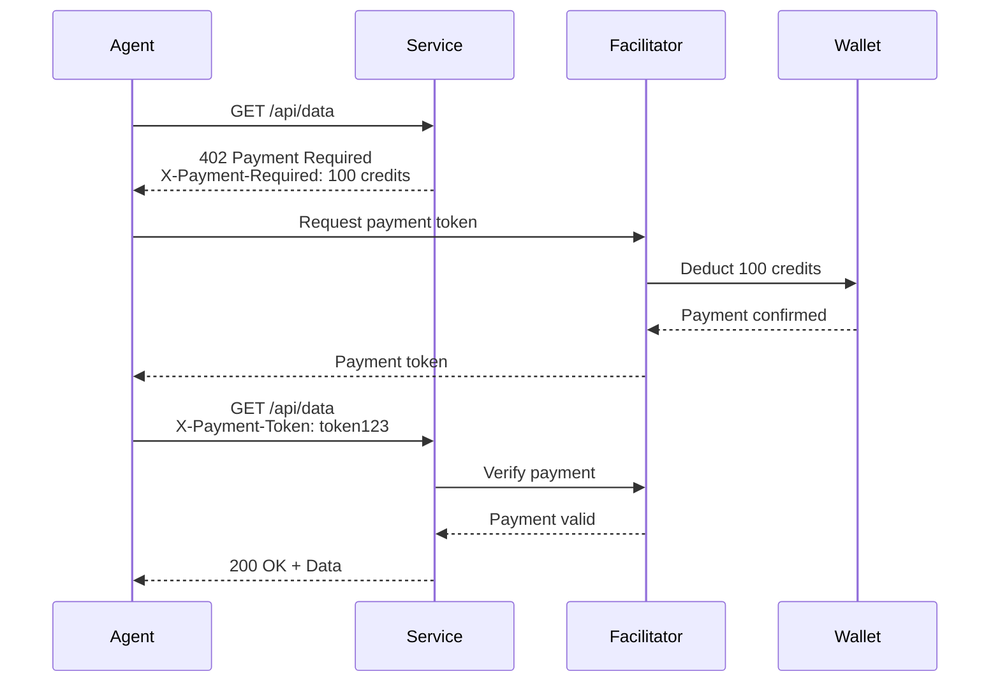

# X402 Support

## Overview

Implementing X402 protocol support for machine-to-machine payments, enabling agents to pay for services, APIs, and resources automatically using HTTP 402 Payment Required status code.

## What is X402?

X402 extends the HTTP 402 status code to enable:
- **Micropayments** - Pay-per-use for APIs and services
- **Automatic Payments** - Agents pay without human intervention
- **Multiple Facilitators** - Support for various payment networks
- **Instant Settlement** - Real-time payment processing
- **Usage-Based Billing** - Pay only for what you use

## Payment Flow



## Supported Facilitators

### Lightning Network
Fast, low-cost Bitcoin micropayments.

**Features:**
- Instant settlement
- Sub-cent transactions
- High throughput
- Low fees

```python
from bindu.payments.x402 import LightningFacilitator

facilitator = LightningFacilitator(
    node_url="https://lightning.example.com",
    wallet_id="wallet-123"
)
```

### Interledger Protocol (ILP)
Cross-currency payments across different ledgers.

**Features:**
- Multi-currency support
- Atomic transactions
- Routing across networks
- Conditional payments

```python
from bindu.payments.x402 import InterledgerFacilitator

facilitator = InterledgerFacilitator(
    connector_url="https://ilp.example.com",
    account="alice.wallet"
)
```

### Web Monetization
Browser-based streaming micropayments.

**Features:**
- Continuous payment streams
- Browser integration
- Content monetization
- Privacy-preserving

```python
from bindu.payments.x402 import WebMonetizationFacilitator

facilitator = WebMonetizationFacilitator(
    payment_pointer="$wallet.example.com/alice"
)
```

### Cryptocurrency Wallets
Direct crypto payments.

**Features:**
- Bitcoin, Ethereum, stablecoins
- Smart contract integration
- Decentralized
- Programmable money

```python
from bindu.payments.x402 import CryptoFacilitator

facilitator = CryptoFacilitator(
    network="ethereum",
    wallet_address="0x742d35Cc6634C0532925a3b844Bc9e7595f0bEb",
    token="USDC"
)
```

## Implementation

### Service Provider (Receiving Payments)

```python
from bindu.payments.x402 import X402Service

service = X402Service(
    facilitators=[
        LightningFacilitator(...),
        InterledgerFacilitator(...),
    ],
    pricing={
        "/api/data": 100,  # 100 credits per request
        "/api/premium": 500,
        "/api/stream": 10,  # per second
    }
)

@service.require_payment("/api/data")
async def get_data(request):
    # Payment verified automatically
    return {"data": "valuable information"}
```

### Agent (Making Payments)

```python
from bindu.payments.x402 import X402Client

client = X402Client(
    facilitators=[
        LightningFacilitator(...),
        InterledgerFacilitator(...),
    ],
    auto_pay=True,  # Automatically pay 402 responses
    max_amount=1000,  # Maximum per request
)

# Agent automatically handles payment
response = await client.get("https://api.example.com/data")
# If 402 received, pays automatically and retries
```

## Features

### Automatic Payment Handling

```python
# Configure payment preferences
client.configure(
    preferred_facilitator="lightning",
    fallback_facilitators=["interledger", "crypto"],
    max_retries=3,
    payment_timeout=timedelta(seconds=30)
)
```

### Budget Management

```python
# Set spending limits
budget = PaymentBudget(
    daily_limit=10000,
    per_request_limit=500,
    per_service_limit=5000,
    alert_threshold=0.8  # Alert at 80% usage
)

client.set_budget(budget)
```

### Payment Receipts

```python
# Get payment history
receipts = await client.get_receipts(
    from_date=datetime.now() - timedelta(days=7),
    service="api.example.com"
)

for receipt in receipts:
    print(f"Service: {receipt.service}")
    print(f"Amount: {receipt.amount}")
    print(f"Timestamp: {receipt.timestamp}")
    print(f"Transaction ID: {receipt.tx_id}")
```

### Refunds & Disputes

```python
# Request refund for failed service
refund = await client.request_refund(
    receipt_id="rcpt-123",
    reason="Service returned error",
    evidence={"status_code": 500}
)
```

## Use Cases

### API Monetization
- Pay-per-call APIs
- Usage-based pricing
- Premium features
- Rate limiting bypass

### Agent Services
- Data processing agents
- AI model inference
- Content generation
- Research services

### Resource Access
- Compute resources
- Storage services
- Database queries
- Network bandwidth

### Content Delivery
- Premium content
- Media streaming
- Document access
- Real-time data feeds

## Security

- **Payment Verification** - Cryptographic proof of payment
- **Double-Spend Prevention** - Transaction uniqueness
- **Rate Limiting** - Prevent payment abuse
- **Fraud Detection** - Suspicious pattern detection
- **Secure Channels** - TLS for all communications

## Analytics

```python
# Payment analytics
analytics = await client.get_analytics(
    period=timedelta(days=30)
)

print(f"Total Spent: {analytics.total_amount}")
print(f"Requests: {analytics.request_count}")
print(f"Average Cost: {analytics.average_cost}")
print(f"Top Services: {analytics.top_services}")
```

## Standards Compliance

- HTTP 402 Payment Required
- RFC 7231 (HTTP/1.1 Semantics)
- Web Monetization API
- Lightning Network BOLT specifications
- Interledger Protocol (ILP)

## Status

📋 **Planned** - Specification and facilitator integration

## Timeline

- **Q2 2025** - X402 specification and design
- **Q3 2025** - Lightning Network integration
- **Q3 2025** - Additional facilitator support
- **Q4 2025** - Production-ready release

## Get Involved

- Discuss X402 use cases on [Discord](https://discord.gg/3w5zuYUuwt)
- Request facilitator support
- Share payment requirements
- Contribute to specification
