It's pretty well-accepted that AI agents struggle with complex, multi-step tasks. You've probably experienced this:

- Ask an agent to do market research → It gives you surface-level insights
- Ask it to build a feature → It works great for the first file, then loses context
- Ask it to analyze data AND write a report → It's mediocre at both

The common response is somewhere between "this will never work" and "maybe someday when there are smarter models."

After several months of building [Bindu](https://github.com/Saptha-me/Bindu) and working with teams deploying agent systems, **I've found that you can get really far with today's models if you embrace agent collaboration principles**.

This isn't another "10x your productivity" pitch. But we've stumbled into patterns that leave me with considerable optimism for what's possible. We've seen agent swarms handle complex research tasks, coordinate across multiple data sources, and produce output that passes expert review.

**I am now fully convinced that multi-agent systems are not just for demos, but rather a deeply technical engineering craft.**

---

## What's Actually Possible Today

Let me be concrete. A few weeks ago, we tested our orchestration approach on a complex market analysis task that typically takes a team of analysts 2-3 days.

**The task:** Analyze the AI agent market, identify key trends, assess competitive landscape, and produce a strategic report.

**What happened:**
- **Research Agent** gathered data from 50+ sources in parallel
- **Analysis Agent** identified patterns and trends
- **Competitive Intel Agent** mapped the landscape
- **Writing Agent** synthesized everything into a coherent report

**Time:** 45 minutes instead of 2-3 days.  
**Quality:** Passed review by a senior analyst who said "this is better than what our team usually produces."

The key insight: **Each agent was a specialist doing one thing well, coordinated by an orchestrator that understood the overall goal.**

---

## Our Weird Journey to Get Here

I was working with a team that was shipping AI-generated code faster than I could review it. Every few days, they'd drop **multi-thousand-line PRs** from agent-generated work.

The problem wasn't the code quality—it was actually pretty good. The problem was **coordination**. Each agent was working in isolation:

- The research agent would gather data, but lose context by the time it got to analysis
- The coding agent would implement features without understanding the broader architecture
- The writing agent would create docs that didn't match what was actually built

**We were getting slop.** Not because the agents were bad, but because they weren't talking to each other.

### The Data Silos Problem

But there was another problem we kept hitting: **data silos**.

Each agent had its own context, its own memory, its own understanding of the task. When the research agent finished, the analysis agent had to start from scratch. When the analysis agent completed, the writing agent couldn't see the original research.

**What this meant in practice:**
- The analysis agent would ask for data the research agent already found
- The writing agent would make claims not supported by the analysis
- Each agent would repeat work the previous agent had done
- Context was lost between steps, leading to inconsistent output

### The Solution: Shared Context

```mermaid
graph TB
    U[User Request] --> O[🧠 Orchestrator]
    O --> SC[(📚 Shared Context<br/>PostgreSQL)]
    
    O --> A1[🔍 Research Agent]
    O --> A2[📊 Analysis Agent]
    O --> A3[✍️ Writing Agent]
    
    A1 -.->|Writes findings| SC
    A2 -.->|Reads research<br/>Writes insights| SC
    A3 -.->|Reads everything<br/>Writes report| SC
    
    SC --> O
    O --> R[✨ Coordinated Result]
    
    style SC fill:#90EE90
    style O fill:#fff4e1
    style A1 fill:#e8f5e9
    style A2 fill:#e8f5e9
    style A3 fill:#e8f5e9
    style R fill:#e1f5ff
```

**Now:**
- All agents write to and read from shared context
- Each agent builds on what previous agents discovered
- No repeated work, no lost context
- The orchestrator manages what context each agent needs

### The Uncomfortable Transformation

We had to completely rethink how agents work. Instead of one agent trying to do everything, we built an orchestrator that:

1. **Breaks down complex tasks** into specialist-appropriate chunks
2. **Routes work to the right agents** based on their capabilities
3. **Manages context** so agents build on each other's work
4. **Coordinates timing** so agents work in parallel when possible

It was uncomfortable at first. We had to learn to trust the orchestrator. But now we're flying.

<Note>
  **The key insight:** A bad line of code is just a bad line of code. But a bad task routing decision could lead to hundreds of wasted agent calls and thousands of lines of wrong output.
</Note>

---

## What Actually Works

After months of experimentation, here's what we've learned:

### 1. Specialist Agents Beat Generalists

**Don't:** Build one agent that tries to do everything  
**Do:** Build focused agents that excel at specific tasks

A research agent that's great at gathering data. An analysis agent that's great at finding patterns. A writing agent that's great at synthesis.

### 2. Orchestration is Everything

**Don't:** Let agents figure out coordination themselves  
**Do:** Build an orchestrator that manages the workflow

The orchestrator is like a project manager. It understands the goal, knows which agents can help, and coordinates their work.

### 3. Parallel > Sequential

**Don't:** Wait for one agent to finish before starting the next  
**Do:** Run independent agents in parallel

Research and competitive analysis can happen simultaneously. Data gathering from multiple sources can be parallelized. This is where you get 3-5x speed improvements.

### 4. Context Management is Critical

**Don't:** Let agents lose context between steps  
**Do:** Maintain shared context that agents can build on

Each agent should see what previous agents discovered. The orchestrator manages this context, keeping it relevant and focused.

### 5. Human Review at High-Leverage Points

**Don't:** Review every line of agent output  
**Do:** Review the task breakdown and routing decisions

A bad routing decision leads to hundreds of wasted agent calls. Review the plan before execution, not just the output after.

---

## How It Works (Simple)

```mermaid
graph LR
    U[👤 You<br/>Ask a complex question] -->|Task| O[🧠 Orchestrator<br/>The Brain]
    O -->|Parallel Work| A1[🔍 Agent 1]
    O -->|Parallel Work| A2[📊 Agent 2]
    O -->|Parallel Work| A3[✍️ Agent 3]
    
    A1 -->|Result| O
    A2 -->|Result| O
    A3 -->|Result| O
    
    O -->|✨ Coordinated<br/>Answer| U
    
    style U fill:#e1f5ff
    style O fill:#fff4e1
    style A1 fill:#e8f5e9
    style A2 fill:#e8f5e9
    style A3 fill:#e8f5e9
```

**Three simple steps:**

1. **You ask** → Complex task that needs multiple skills
2. **Orchestrator coordinates** → Picks the right agents, runs them in parallel
3. **You get results** → Fast, high-quality, comprehensive answer

---

## This is Not Magic

Remember that part where I said "passed expert review"? That required a human expert to actually review it. You have to engage with the task or it WILL NOT WORK.

There's a certain type of person who is always looking for the one magic orchestration pattern that will solve all their problems. It doesn't exist.

What makes agent swarms **good enough for hard problems** is that you build high-leverage human review into your pipeline.

### Where We've Failed

A few weeks back, we tried to use our orchestration approach on a deeply technical infrastructure migration. It did not go well.

**What went wrong:**
- The research agents didn't go deep enough into dependencies
- The planning agent made assumptions that weren't validated
- We ended up with a plan that would have created more problems than it solved

**The learning:** You probably need at least one person who is an expert in the domain. For complex technical work, agent swarms augment expertise—they don't replace it.

### On Human Leverage

If there's one thing you take away from all this, let it be this:

**Focus human effort on the highest-leverage parts of the pipeline.**

- A bad line of agent output → One bad result
- A bad task breakdown → Hundreds of wasted agent calls  
- A bad routing decision → Thousands of lines of wrong output

Review the orchestration decisions, not just the final output.

---

## What We're Building

**Saptha.me** is the orchestration platform for agent swarms. We're building the infrastructure that lets agents work together effectively.

### The Core Problem We're Solving

Today, if you want agents to collaborate, you have to:
- Build your own orchestration logic
- Figure out context management yourself
- Handle agent discovery and routing manually
- Deal with different agent frameworks not talking to each other

**We're building the platform that handles all of this.**

### What's Working Today

- ✅ **Intelligent task routing** - Orchestrator breaks down complex tasks and routes to specialist agents
- ✅ **Context management** - Shared context that agents build on, managed automatically
- ✅ **Parallel execution** - Independent agents work simultaneously
- ✅ **A2A Protocol** - Standard communication so any agent can join the swarm

### What We're Working On

- 🚧 **Agent marketplace** - Discover and use specialized agents built by others
- 🚧 **Built-in payments** - Agents can charge for their services (x402 protocol)
- 🚧 **DID-based identity** - Verifiable agent identities for trust
- 🚧 **Cross-framework support** - LangChain, CrewAI, custom agents all work together

### What's Still Hard

- ❌ **Deep technical migrations** - Still need domain experts
- ❌ **Novel problem spaces** - Agents struggle without existing patterns
- ❌ **Complex dependency trees** - Research agents don't always go deep enough

**We're not claiming this solves everything.** But for a growing class of problems—research, analysis, content creation, data processing—it works remarkably well.

---

## Who This Is For

### If you're building agents

You've probably hit the limits of single-agent systems. You need orchestration, context management, and a way for agents to work together.

**Start here:** [Build your first agent with Bindu](/bindu/introduction/what-is-bindu)

### If you're deploying agent systems

You need reliability, observability, and the ability to coordinate multiple agents for complex workflows.

**Start here:** [Saptha.me GitHub](https://github.com/Saptha-me/sapthame)

### If you're researching multi-agent systems

You want to understand what actually works in production, not just what works in demos.

**Start here:** [Join our Discord](https://discord.gg/3w5zuYUuwt) - we're sharing learnings openly

---

## What's Next

We're actively working on this. The platform is in development. The patterns are being refined. The infrastructure is being built.

**What we're looking for:**

1. **Early adopters** - Teams willing to test orchestration patterns in production
2. **Agent builders** - Developers creating specialized agents that can join swarms
3. **Feedback** - What works, what doesn't, what's missing

**What we're NOT looking for:**

- People expecting magic solutions
- Teams that won't engage with the orchestration decisions
- Use cases that need 100% reliability on day one

<Warning>
  **This is early-stage infrastructure.** If you need battle-tested, enterprise-ready orchestration today, we're not there yet. But if you want to be part of figuring out how agents should work together, let's talk.
</Warning>

---

## Get Involved

**Try it:**
- [Saptha.me on GitHub](https://github.com/Saptha-me/sapthame)
- [Bindu Agent Framework](https://github.com/Saptha-me/Bindu)

**Connect:**
- [Discord Community](https://discord.gg/3w5zuYUuwt) - Daily discussions
- [Email me](mailto:raahul@saptha.me) - For partnerships or serious inquiries

**Follow:**
- [Twitter](https://twitter.com/saptha_me) - Updates and learnings
- [GitHub](https://github.com/Saptha-me) - Watch our progress

---

## Recap

- Single agents struggle with complex, multi-step tasks
- Agent swarms with specialist agents work better
- Orchestration and context management are critical
- Human review at high-leverage points is essential
- This works for a growing class of problems, but not everything
- We're building the infrastructure to make this easier

**The future of AI is collaborative.** We're building the platform that makes collaboration work.

---

*Where AI agents bloom and ideas take flight* 🌻
