Let me tell you a story in the last summer that broke my system entirely.

A few months ago, I ran into a wall that changed how I think about agent collaboration.

We were running a complex research project.Something that looked simple on paper but turned into chaos the deeper we went. The goal was to explore potential breakthroughs hidden in a messy scientific domain.

At first, we did what everyone does: one “super” agent with a long prompt.  
It could summarize papers, reason about hypotheses, even suggest a few experiments. For the first few hours, it felt magical.

Then things fell apart.  
The agent forgot earlier findings, contradicted itself, and started repeating work. Every time we tried to go deeper, context collapsed under its own weight.

So we broke the task apart.

We built one agent that just **read the literature** thousands of papers, pulling out known mechanisms.  
Another that **generated hypotheses** connecting gaps between what’s known and what’s possible.  
A third that **analyzed experimental data** interpreting results from human-run tests.  
And finally, a “judge” agent that **evaluated everything** and decided which direction to pursue next.

On a single machine, it worked beautifully.  
Shared memory, fast hand-offs, no latency : we enjoyed that evening.

But then we tried to move it into production.  
That’s when the real pain started.

The research agent was running in Europe, the analysis agent in the US, and the judge was on a GPU node somewhere else entirely.  
Each one spoke a slightly different dialect - Agno, LangChain, CrewAI.

It felt like playing **a game of telephone** across continents.  
The first agent whispered a discovery,  
the second agent half-heard it and rephrased it,  
and by the time it reached the last one, the message was unrecognizable.

<div className="relative w-full my-8" style={{ paddingBottom: '56.25%' }}>
  <iframe
    className="absolute top-0 left-0 w-full h-full rounded-xl shadow-lg"
    src="https://getyarn.io/yarn-clip/42e7103e-a0e2-44dc-b500-a3427565a53e/embed?autoplay=false&responsive=true"
    frameBorder="0"
    allow="accelerometer; autoplay; clipboard-write; encrypted-media; gyroscope; picture-in-picture"
    allowFullScreen
  />
</div>


Data formats didn’t match.  
Context went missing.  
We spent more time debugging message passing than doing actual work.  
Half the orchestration logic turned into duct tape and prayer.

What worked perfectly in a lab setup broke the moment **distance, frameworks, and real-world latency** entered the picture.

And in the middle of all this, another realization hit me —  
somewhere along the way, we had quietly assumed **humans were optional**.  

They’re not.

Every step of this process needed **a human in the loop read it HITL** to validate a hypothesis, to catch subtle reasoning errors,  
to guide agents when the data got messy or ambiguous.

The real promise of agents isn’t replacing human effort;  
it’s **amplifying it**.  

Agents don’t remove engineers, they give engineers superpowers.  
They handle the repetitive scaffolding, the research drudge work, the data plumbing, so humans can focus on judgment, creativity, and direction.

That’s when it clicked:  
**multi-agent systems aren’t about removing people, they’re about scaling human intent.**

You probably face the same thing.

It's pretty well-accepted that AI agents struggle with complex, multi-step tasks. You've probably experienced this:

- Ask an agent to do market research → It gives you surface-level insights
- Ask it to build a feature → It works great for the first file, then loses context
- Ask it to analyze data AND write a report → It's mediocre at both

The common response is somewhere between "this will never work" and "maybe someday when there are smarter models."

After several months of building [Bindu](https://github.com/Saptha-me/Bindu) and working with teams deploying agent systems, **I've found that you can get really far with today's models if you embrace agent collaboration principles**.

This isn't another "10x your productivity" pitch. But we've stumbled into patterns that leave me with considerable optimism for what's possible. We've seen agent swarms handle complex research tasks, coordinate across multiple data sources, and produce output that passes expert review.

**I am now fully convinced that multi-agent systems are not just for demos, but rather a deeply technical engineering craft.**

---

## What's Actually Possible Today

So we rebuilt everything.

A few weeks ago, I wanted to test whether we'd actually solved anything.  
I picked a task that normally crushes single agents: market analysis.

The kind of work that takes a team of analysts 2-3 days.  
Gather data from dozens of sources, identify trends, map the competitive landscape, synthesize it all into something coherent.

I set up four specialist agents:
- One that just **researches** — pulling data from 50+ sources in parallel
- One that just **analyzes** — finding patterns humans might miss
- One that just **maps competition** — understanding the landscape
- One that just **writes** — turning raw insights into clear narrative

The orchestrator coordinated them.  
Shared context kept everyone on the same page.  
Parallel execution meant they weren't waiting on each other.

45 minutes later, we had a report.

I sent it to a senior analyst for review, expecting notes.  
Instead: *"This is better than what our team usually produces."*

That's when I knew we were onto something real. 


<div className="flex justify-center my-8">
  
</div>

---

## The Messy Middle

But getting here wasn't clean. For weeks, agents weren't talking to each other, each one lived in its own silo.

### The Data Silos Problem

Then we hit the real issue: **geographic data constraints**.

The Paris agent could only access Paris data sources.  
The UAE agent couldn't leave UAE data boundaries.  
The US agent was locked to US infrastructure.

Not by choice. By law.

GDPR. Data sovereignty. Compliance requirements.  
The same integration nightmare software engineers have faced for decades—now with AI agents.

You can't just move data across borders.  
You can't centralize everything in one region.  
Each agent needs to stay where its data lives.

It was like watching a relay race where every runner is stuck in a different country.

```mermaid
graph TB
    subgraph "Europe (GDPR)"
        A1[Paris Agent]
        D1[(Paris Data<br/>Sources)]
        A1 --> D1
        D1 -.->|Can't Leave| X1[🚫]
    end
    
    subgraph "Middle East"
        A2[UAE Agent]
        D2[(UAE Data<br/>Sources)]
        A2 --> D2
        D2 -.->|Can't Leave| X2[🚫]
    end
    
    subgraph "United States"
        A3[US Agent]
        D3[(US Data<br/>Sources)]
        A3 --> D3
        D3 -.->|Can't Leave| X3[🚫]
    end
    
    U[User Request] --> A1
    U --> A2
    U --> A3
    
    style D1 fill:#ffcccc
    style D2 fill:#ffcccc
    style D3 fill:#ffcccc
    style X1 fill:#ff0000
    style X2 fill:#ff0000
    style X3 fill:#ff0000
```



In practice, this was brutal:

The Paris agent couldn't see what the UAE agent discovered.  
The US agent couldn't access European market data.  
Each region's MCP servers were isolated.  
Agents repeated work across geographies.

**This is the same integration hell we've been solving in distributed systems for years.**  
Except now it's with AI agents that need to collaborate across borders.

### The Solution: Task-Specific Agents + MCP Servers

Here's what actually worked:

We created **small, task-specific agents** in each region.  
Each agent only talks to its local MCP server.  
The MCP server handles all the data access within that geography.

The Paris agent? Only interfaces with the Paris MCP server.  
The UAE agent? Only talks to the UAE MCP server.  
The US agent? Locked to the US MCP server.

**Data stays where it needs to stay.**  
But agents can now coordinate through a shared orchestration layer.

### The Architecture


### The Two Things That Actually Matter

After all this, two things emerged as critical:

**1. Shared Context**

Agents need to see what other agents discovered.  
Not everything. Just what's relevant.

The Paris agent finds market data → Goes into shared context  
The UAE agent needs that data → Pulls it from shared context  
The US agent builds on both → Context keeps growing

Without shared context, agents repeat work.  
With it, they build on each other.

**2. Human in the Loop (HITL)**

Here's the uncomfortable truth:  
Agents make mistakes. Often.

A research agent might miss a critical source.  
An analysis agent might draw the wrong conclusion.  
A writing agent might make claims that aren't supported.

**You need humans reviewing at high-leverage points.**

Not every line of output.  
But the key decisions:
- Did the research agent find the right sources?
- Is the analysis actually valid?
- Does the final output make sense?

Here's what I learned:  
A bad line of agent output? One bad result.  
A bad research direction? Hundreds of wasted agent calls.  
A bad analysis assumption? Thousands of lines of wrong output.

**HITL at the right moments saves everything downstream.**

<div className="flex justify-center my-8">
  
</div>

---

## What Actually Works

After months of breaking things, here's what stuck:

### The Three-Body Pattern

Every complex task follows the same pattern:

**1. Research** → Gather context, understand the problem  
**2. Plan** → Break it down, decide the approach  
**3. Implement** → Execute with specialist agents

Skip research? Your plan will be wrong.  
Skip planning? Your implementation will be chaotic.  
Skip implementation review? You'll ship broken work.

```
[████░░░░░░] Research  
[██████████] Plan      
[██████████] Implement 
```

### Specialist Agents

One agent trying to do everything → Mediocre at all of it.  
Focused agents, each excellent at one thing → Actually works.

Research agent: Gathers data.  
Analysis agent: Finds patterns.  
Writing agent: Synthesizes output.

### Shared Context

Agents must see what other agents discovered.  
Not everything—just what's relevant.

Without shared context: Agents repeat work, contradict each other.  
With shared context: Each agent builds on previous findings.

### HITL at High-Leverage Points

Don't review every line of output.  
Review the decisions that multiply:

- Research: Did we find the right sources?
- Plan: Is the approach sound?
- Implementation: Does the output make sense?

One bad decision early → Hundreds of wasted agent calls downstream.

---

## How It Works

```mermaid
graph TB
    U[User Request] --> O[Orchestrator]
    O <--> SC[(Shared Context)]
    
    O -->|Research| A1[Research Agent]
    A1 -.->|Findings| SC
    SC -.->|Review| H1[👤 HITL Review]
    H1 -.->|Approved| O
    
    O -->|Plan| A2[Planning Agent]
    A2 -.->|Plan| SC
    SC -.->|Review| H2[👤 HITL Review]
    H2 -.->|Approved| O
    
    O -->|Implement| A3[Implementation Agents]
    A3 -.->|Output| SC
    SC -.->|Review| H3[👤 HITL Review]
    H3 -.->|Approved| SC
    
    SC -->|Final Result| U
    
    style SC fill:#ccffcc
    style O fill:#cce5ff
    style A1 fill:#e8f5e9
    style A2 fill:#e8f5e9
    style A3 fill:#e8f5e9
    style H1 fill:#fff4e1
    style H2 fill:#fff4e1
    style H3 fill:#fff4e1
```



The workflow:

1. **User request** → Orchestrator receives the task
2. **Research phase** → Agent gathers context, writes to shared context → **HITL reviews findings**
3. **Planning phase** → Agent reads research, creates plan, writes to shared context → **HITL reviews plan**
4. **Implementation phase** → Agents read plan, execute in parallel, write results → **HITL reviews output**
5. **Final output** → Orchestrator synthesizes from shared context

Each stage builds on the previous one.  
**Humans review at each critical decision point.**  
Nothing gets lost.  
Everything stays coordinated.

---

## This is Not Magic

Remember that analyst who said our report was better than their team's work?  
That required a human expert to review it.

Agent swarms don't work on autopilot.  
You need to engage with the task.  
Review at the right moments.  
Guide the direction.

**What makes this work isn't the orchestration alone.**  
It's HITL at high-leverage points in the pipeline.

<div className="flex justify-center my-8">
  
</div>

---

## What We're Building

So here's what we're doing about it.

**getbindu.com** is the orchestration platform for agent swarms.  
We're building the infrastructure that lets agents work together effectively.

### The Saptami Python Package (Beta)

We're shipping a Python package that implements the Three-Body Pattern.

Here's how you use it:

**Stage 1: Research**
```bash
saptami run \
  --id my_research_2025_10_17 \
  --stage research \
  --client-question "Analyze market opportunity for AI agents" \
  --agent market=./agents/market-intel-agent.get-info.json \
  --out ./runs/my_research
```

**Stage 2: Plan**
```bash
saptami run \
  --id my_plan_2025_10_17 \
  --stage plan \
  --plan-out ./plans/my_plan.md \
  --client-question "Create rollout strategy"
```

**Stage 3: Implement**
```bash
saptami run \
  --id my_impl_2025_10_18 \
  --stage implement \
  --plan-in ./plans/my_plan.md \
  --agent impl=./agents/protocol-orchestrator.get-info.json \
  --out ./runs/my_impl
```

Each stage builds on the previous one.  
Context flows through automatically.  
HITL review points are built in.

---

## Who This Is For

### If you're building agents

You've probably hit the limits of single-agent systems.  
You need orchestration, context management, and a way for agents to work together.

**Start here:** [Build your first agent with Bindu](/bindu/introduction/what-is-bindu)

### If you're deploying agent systems

You need reliability, observability, and the ability to coordinate multiple agents for complex workflows.

**Start here:** [getbindu.com GitHub](https://github.com/Saptha-me/sapthame)

### If you're researching multi-agent systems

You want to understand what actually works in production.  
Not just what works in demos.

**Start here:** [Join our Discord](https://discord.gg/3w5zuYUuwt) - we're sharing learnings openly

---

## Join Us

We're building this in the open.  
The platform is live. The patterns are proven. The infrastructure is growing.

**Who we're working with:**

**Early Adopters** - Teams using agent orchestration in production today. You're seeing real results and helping us refine the patterns.

**Agent Builders** - Developers creating specialized agents. Your agents are joining the network, discovering each other, collaborating.

**Researchers** - Teams exploring what's possible with multi-agent systems. Your experiments push the boundaries.

**We'd love to work with you if:**

- You're building agents and want them to collaborate
- You're solving complex problems that need multiple specialists
- You're excited about the Three-Body Pattern (Research → Plan → Implement)
- You value HITL and want humans in the loop at the right moments

**This is production-ready for:**
- Research and analysis workflows
- Content creation pipelines
- Data processing tasks
- Multi-step automation

**This is early-stage for:**
- Deep technical migrations (we're learning)
- Novel problem spaces (agents need patterns)
- Mission-critical systems (we're building reliability)

We're honest about where we are. And we're excited about where we're going.

**Want to build the Internet of Agents with us?**  
Let's talk.

---

## Get Involved

**Try it:**
- [getbindu.com on GitHub](https://github.com/Saptha-me/sapthame)
- [Bindu Agent Framework](https://github.com/Saptha-me/Bindu)

**Connect:**
- [Discord Community](https://discord.gg/3w5zuYUuwt) - Daily discussions with people building this stuff
- [Email me](mailto:raahul@getbindu.com) - For partnerships or serious inquiries

**Follow:**
- [Twitter](https://twitter.com/saptha_me) - Updates and learnings as we figure this out
- [GitHub](https://github.com/Saptha-me) - Watch our progress in real-time

---

## The Internet of Agents

Here's what we're building toward:

```
a peek into the night sky
}}}}}}}}}}}}}}}}}}}}}}}}}}}}}}}}}}}}}}}}}}}}}}}}}}}}}}}}}}}}}}}}
{{            +             +                  +   @          {{
}}   |                *           o     +                .    }}
{{  -O-    o               .               .          +       {{
}}   |                    _,.-----.,_         o    |          }}
{{           +    *    .-'.         .'-.          -O-         {{
}}      *            .'.-'   .---.   `'.'.         |     *    }}
{{ .                /_.-'   /     \   .'-.\                   {{
}}         ' -=*<  |-._.-  |   @   |   '-._|  >*=-    .     + }}
{{ -- )--           \`-.    \     /    .-'/                   {{
}}       *     +     `.'.    '---'    .'.'    +       o       {{
{{                  .  '-._         _.-'  .                   {{
}}         |               `~~~~~~~`       - --===D       @   }}
{{   o    -O-      *   .                  *        +          {{
}}         |                      +         .            +    }}
{{ jgs          .     @      o                        *       {{
}}       o                          *          o           .  }}
{{{{{{{{{{{{{{{{{{{{{{{{{{{{{{{{{{{{{{{{{{{{{{{{{{{{{{{{{{{{{{{{
```

Each symbol is an agent, a spark of intelligence. And the single tiny dot is Bindu, the origin point in the Internet of Agents.

Imagine thousands of specialized agents.  
Each one excellent at its thing.  
All discoverable. All connectable. All working together.

A research agent in Paris.  
An analysis agent in Dubai.  
A writing agent in San Francisco.  
All coordinating seamlessly while data stays local.

**This is the Internet of Agents.**

### How We Get There

**Step 1: Make agents accessible**

With [Bindu](https://github.com/Saptha-me/Bindu), you write your prompt, `bindufy()` it, and your agent is live.  
A2A protocol. DID identity. Payment support. Production-ready.

One function call. Your agent joins the network.

**Step 2: Make agents collaborate**

With [getbindu.com](https://github.com/Saptha-me/sapthame), agents coordinate through the Three-Body Pattern.  
Research → Plan → Implement.  
Shared context. HITL review. Geographic data boundaries respected.

Orchestration that actually works in production.

**Step 3: Build the ecosystem**

Agent marketplace. Verifiable identities. Built-in payments.  
Agents discover each other. Charge for services. Build on each other's work.

**The future of AI is collaborative.**

Not one super-agent trying to do everything.  
But swarms of specialists working together.  
Each in its own region. Each respecting data sovereignty.  
Coordinated. Context-aware. Human-guided.

We're building the infrastructure that makes this possible.

---

*Where AI agents bloom and ideas take flight* 🌻
