```mermaid
graph TB
    U[User Request] --> O[🧠 Orchestrator]
    O --> SC[(📚 Shared Context<br/>PostgreSQL)]
    
    O --> A1[🔍 Research Agent]
    O --> A2[📊 Analysis Agent]
    O --> A3[✍️ Writing Agent]
    
    A1 -.->|Writes findings| SC
    A2 -.->|Reads research<br/>Writes insights| SC
    A3 -.->|Reads everything<br/>Writes report| SC
    
    SC --> O
    O --> R[✨ Coordinated Result]
    
    style SC fill:#90EE90
    style O fill:#fff4e1
    style A1 fill:#e8f5e9
    style A2 fill:#e8f5e9
    style A3 fill:#e8f5e9
    style R fill:#e1f5ff
```

Let me tell you a story in the last summer that broke my system entirely.

A few months ago, I ran into a wall that changed how I think about agent collaboration.

We were running a complex research project — something that looked simple on paper but turned into chaos the deeper we went. The goal was to explore potential breakthroughs hidden in a messy scientific domain.

At first, we did what everyone does: one “super” agent with a long prompt.  
It could summarize papers, reason about hypotheses, even suggest a few experiments. For the first few hours, it felt magical.

Then things fell apart.  
The agent forgot earlier findings, contradicted itself, and started repeating work. Every time we tried to go deeper, context collapsed under its own weight.

So we broke the task apart.

We built one agent that just **read the literature** — thousands of papers, pulling out known mechanisms.  
Another that **generated hypotheses** — connecting gaps between what’s known and what’s possible.  
A third that **analyzed experimental data** — interpreting results from human-run tests.  
And finally, a “judge” agent that **evaluated everything** and decided which direction to pursue next.

On a single machine, it worked beautifully.  
Shared memory, fast hand-offs, no latency — everything clicked.

But then we tried to move it into production.  
That’s when the real pain started.

The research agent was running in Europe, the analysis agent in the US, and the judge was on a GPU node somewhere else entirely.  
Each one spoke a slightly different dialect — Agno, LangChain, CrewAI.

It felt like playing **a game of telephone** across continents.  
The first agent whispered a discovery,  
the second agent half-heard it and rephrased it,  
and by the time it reached the last one, the message was unrecognizable.

Data formats didn’t match.  
Context went missing.  
We spent more time debugging message passing than doing actual work.  
Half the orchestration logic turned into duct tape and prayer.

What worked perfectly in a lab setup broke the moment **distance, frameworks, and real-world latency** entered the picture.

And in the middle of all this, another realization hit me —  
somewhere along the way, we had quietly assumed **humans were optional**.  
They’re not.

Every step of this process needed **a human in the loop** —  
to validate a hypothesis, to catch subtle reasoning errors,  
to guide agents when the data got messy or ambiguous.

The real promise of agents isn’t replacing human effort;  
it’s **amplifying it**.  
Agents don’t remove engineers — they give engineers superpowers.  
They handle the repetitive scaffolding, the research drudge work, the data plumbing —  
so humans can focus on judgment, creativity, and direction.

That’s when it clicked:  
**multi-agent systems aren’t about removing people — they’re about scaling human intent.**

you probably face the same thing.

It's pretty well-accepted that AI agents struggle with complex, multi-step tasks. You've probably experienced this:

- Ask an agent to do market research → It gives you surface-level insights
- Ask it to build a feature → It works great for the first file, then loses context
- Ask it to analyze data AND write a report → It's mediocre at both

The common response is somewhere between "this will never work" and "maybe someday when there are smarter models."

After several months of building [Bindu](https://github.com/Saptha-me/Bindu) and working with teams deploying agent systems, **I've found that you can get really far with today's models if you embrace agent collaboration principles**.

This isn't another "10x your productivity" pitch. But we've stumbled into patterns that leave me with considerable optimism for what's possible. We've seen agent swarms handle complex research tasks, coordinate across multiple data sources, and produce output that passes expert review.

**I am now fully convinced that multi-agent systems are not just for demos, but rather a deeply technical engineering craft.**

---

## What's Actually Possible Today

So we rebuilt everything.

A few weeks ago, I wanted to test whether we'd actually solved anything.  
I picked a task that normally crushes single agents: market analysis.

The kind of work that takes a team of analysts 2-3 days.  
Gather data from dozens of sources, identify trends, map the competitive landscape, synthesize it all into something coherent.

I set up four specialist agents:
- One that just **researches** — pulling data from 50+ sources in parallel
- One that just **analyzes** — finding patterns humans might miss
- One that just **maps competition** — understanding the landscape
- One that just **writes** — turning raw insights into clear narrative

The orchestrator coordinated them.  
Shared context kept everyone on the same page.  
Parallel execution meant they weren't waiting on each other.

45 minutes later, we had a report.

I sent it to a senior analyst for review, expecting notes.  
Instead: *"This is better than what our team usually produces."*

That's when I knew we were onto something real.

---

## The Messy Middle

But getting here wasn't clean.

For weeks, I was drowning in code reviews.  
The team was shipping **multi-thousand-line PRs** from agent-generated work.  
Fast. Really fast.

The code quality? Actually pretty good.  
The problem? **Nothing connected.**

The research agent would gather data, then forget it by the time analysis started.  
The coding agent would implement features without seeing the broader architecture.  
The writing agent would create docs that didn't match what was actually built.

We were getting slop.  
Not because the agents were bad.  
But because they weren't talking to each other.

### The Data Silos Problem

Then we hit the real issue: **data silos**.

Each agent lived in its own world.  
Its own context. Its own memory. Its own version of reality.

When the research agent finished, the analysis agent started from zero.  
When analysis completed, the writing agent couldn't see the original research.

It was like watching a relay race where every runner starts at the beginning instead of where the last one left off.

In practice, this was painful:

The analysis agent would ask for data the research agent already found.  
The writing agent would make claims the analysis never supported.  
Agents repeated each other's work.  
Context evaporated between steps.

Everything was inconsistent.

### We Fixed It With Shared Context

Now all agents write to and read from the same place.  
PostgreSQL becomes the shared brain.

Each agent builds on what the previous one discovered.  
No repeated work. No lost context.  
The orchestrator manages what each agent needs to see.

### The Uncomfortable Transformation

We had to completely rethink how agents work.

Instead of one agent trying to do everything, we built an orchestrator that:
- Breaks down complex tasks into specialist-appropriate chunks
- Routes work to the right agents based on their capabilities
- Manages context so agents build on each other's work
- Coordinates timing so agents work in parallel when possible

It was uncomfortable at first.  
We had to learn to trust the orchestrator.  
Let go of control.  
Stop micromanaging every step.

But once we did? We started flying.

Here's what I learned:  
A bad line of code is just a bad line of code.  
But a bad task routing decision? That leads to hundreds of wasted agent calls.  
Thousands of lines of wrong output.

The orchestration decisions matter more than the code.

---

## What Actually Works

After months of breaking things and putting them back together, here's what stuck:

### 1. Specialists Win

Don't build one agent that tries to do everything.  
Build focused agents that excel at one thing.

A research agent that's **great** at gathering data.  
An analysis agent that's **great** at finding patterns.  
A writing agent that's **great** at synthesis.

Generalists are mediocre at everything.  
Specialists are excellent at their thing.

### 2. Orchestration is Everything

Don't let agents figure out coordination themselves.  
They won't.

Build an orchestrator that manages the workflow.  
Think of it like a project manager who understands the goal, knows which agents can help, and coordinates their work.

Without orchestration, you have chaos.  
With it, you have a system.

### 3. Parallel > Sequential

Don't wait for one agent to finish before starting the next.  
That's how you waste time.

Run independent agents in parallel.

Research and competitive analysis? Simultaneously.  
Data gathering from multiple sources? Parallelized.  
This is where you get 3-5x speed improvements.

### 4. Context Management is Critical

Don't let agents lose context between steps.  
That's how you get inconsistent output.

Maintain shared context that agents build on.  
Each agent sees what previous agents discovered.  
The orchestrator manages this, keeping it relevant and focused.

### 5. Human Review at High-Leverage Points

Don't review every line of agent output.  
You'll burn out.

Review the task breakdown and routing decisions.  
That's where mistakes multiply.

A bad routing decision → hundreds of wasted agent calls.  
Review the plan before execution, not just the output after.

---

## How It Works (Simple)

```mermaid
graph LR
    U[👤 You<br/>Ask a complex question] -->|Task| O[🧠 Orchestrator<br/>The Brain]
    O -->|Parallel Work| A1[🔍 Agent 1]
    O -->|Parallel Work| A2[📊 Agent 2]
    O -->|Parallel Work| A3[✍️ Agent 3]
    
    A1 -->|Result| O
    A2 -->|Result| O
    A3 -->|Result| O
    
    O -->|✨ Coordinated<br/>Answer| U
    
    style U fill:#e1f5ff
    style O fill:#fff4e1
    style A1 fill:#e8f5e9
    style A2 fill:#e8f5e9
    style A3 fill:#e8f5e9
```

Here's how it actually works:

1. **You ask** → Give it a complex task that needs multiple skills
2. **Orchestrator coordinates** → Picks the right agents, runs them in parallel
3. **You get results** → Fast, high-quality, comprehensive answer

Simple in theory.  
Hard in practice.  
Worth it when it works.

---

## This is Not Magic

Let me be clear about something.

Remember that analyst who said our report was better than their team's work?  
That required an actual human expert to review it.

You have to engage with the task.  
You can't just throw prompts at the orchestrator and hope for the best.

There's a certain type of person who's always looking for the one magic pattern that will solve all their problems.

It doesn't exist.

What makes agent swarms **good enough for hard problems** isn't the orchestration alone.  
It's building high-leverage human review into your pipeline.

### Where We've Failed

A few weeks back, we got cocky.

We tried using our orchestration approach on a deeply technical infrastructure migration.  
The kind of work that requires deep domain knowledge.

It did not go well.

The research agents didn't go deep enough into dependencies.  
The planning agent made assumptions that weren't validated.  
We ended up with a plan that would have created more problems than it solved.

We caught it during review, thankfully.  
But it was a reminder:

**You need at least one person who's an expert in the domain.**

For complex technical work, agent swarms augment expertise.  
They don't replace it.

### On Human Leverage

If you take away one thing from all this, let it be this:

**Focus human effort on the highest-leverage parts of the pipeline.**

A bad line of agent output? One bad result.  
A bad task breakdown? Hundreds of wasted agent calls.  
A bad routing decision? Thousands of lines of wrong output.

The earlier in the pipeline you catch mistakes, the more leverage you have.

Review the orchestration decisions.  
Not just the final output.

---

## What We're Building

So here's what we're doing about it.

**Saptha.me** is the orchestration platform for agent swarms.  
We're building the infrastructure that lets agents work together effectively.

### The Core Problem

Today, if you want agents to collaborate, you have to build everything yourself:
- Your own orchestration logic
- Your own context management
- Your own agent discovery and routing
- Your own way to make different frameworks talk to each other

It's exhausting.  
And most teams don't have time for it.

**We're building the platform that handles all of this.**

### What's Working Today

We've shipped:
- ✅ **Intelligent task routing** - The orchestrator breaks down complex tasks and routes to specialist agents
- ✅ **Context management** - Shared context that agents build on, managed automatically
- ✅ **Parallel execution** - Independent agents work simultaneously
- ✅ **A2A Protocol** - Standard communication so any agent can join the swarm

### What We're Working On

We're building:
- 🚧 **Agent marketplace** - Discover and use specialized agents built by others
- 🚧 **Built-in payments** - Agents can charge for their services (x402 protocol)
- 🚧 **DID-based identity** - Verifiable agent identities for trust
- 🚧 **Cross-framework support** - LangChain, CrewAI, custom agents all work together

### What's Still Hard

Let me be honest about what doesn't work yet:
- ❌ **Deep technical migrations** - Still need domain experts
- ❌ **Novel problem spaces** - Agents struggle without existing patterns
- ❌ **Complex dependency trees** - Research agents don't always go deep enough

We're not claiming this solves everything.

But for a growing class of problems—research, analysis, content creation, data processing—it works remarkably well.

---

## Who This Is For

### If you're building agents

You've probably hit the limits of single-agent systems.  
You need orchestration, context management, and a way for agents to work together.

**Start here:** [Build your first agent with Bindu](/bindu/introduction/what-is-bindu)

### If you're deploying agent systems

You need reliability, observability, and the ability to coordinate multiple agents for complex workflows.

**Start here:** [Saptha.me GitHub](https://github.com/Saptha-me/sapthame)

### If you're researching multi-agent systems

You want to understand what actually works in production.  
Not just what works in demos.

**Start here:** [Join our Discord](https://discord.gg/3w5zuYUuwt) - we're sharing learnings openly

---

## What's Next

We're actively working on this.  
The platform is in development.  
The patterns are being refined.  
The infrastructure is being built.

**What we're looking for:**

1. **Early adopters** - Teams willing to test orchestration patterns in production
2. **Agent builders** - Developers creating specialized agents that can join swarms
3. **Feedback** - What works, what doesn't, what's missing

**What we're NOT looking for:**

People expecting magic solutions.  
Teams that won't engage with the orchestration decisions.  
Use cases that need 100% reliability on day one.

Let me be clear:  
**This is early-stage infrastructure.**

If you need battle-tested, enterprise-ready orchestration today, we're not there yet.

But if you want to be part of figuring out how agents should work together?  
Let's talk.

---

## Get Involved

**Try it:**
- [Saptha.me on GitHub](https://github.com/Saptha-me/sapthame)
- [Bindu Agent Framework](https://github.com/Saptha-me/Bindu)

**Connect:**
- [Discord Community](https://discord.gg/3w5zuYUuwt) - Daily discussions with people building this stuff
- [Email me](mailto:raahul@saptha.me) - For partnerships or serious inquiries

**Follow:**
- [Twitter](https://twitter.com/saptha_me) - Updates and learnings as we figure this out
- [GitHub](https://github.com/Saptha-me) - Watch our progress in real-time

---

## The Story So Far

Single agents struggle with complex, multi-step tasks.  
We've all seen it.

Agent swarms with specialist agents work better.  
But only if you get orchestration and context management right.

Human review at high-leverage points is essential.  
This isn't about replacing people—it's about amplifying them.

This works for a growing class of problems.  
Research, analysis, content creation, data processing.  
But not everything. Not yet.

We're building the infrastructure to make this easier.  
To make agent collaboration actually work in production.

**The future of AI is collaborative.**

Not one super-agent trying to do everything.  
But swarms of specialists working together.  
Coordinated. Context-aware. Human-guided.

We're building the platform that makes that possible.

---

*Where AI agents bloom and ideas take flight* 🌻
